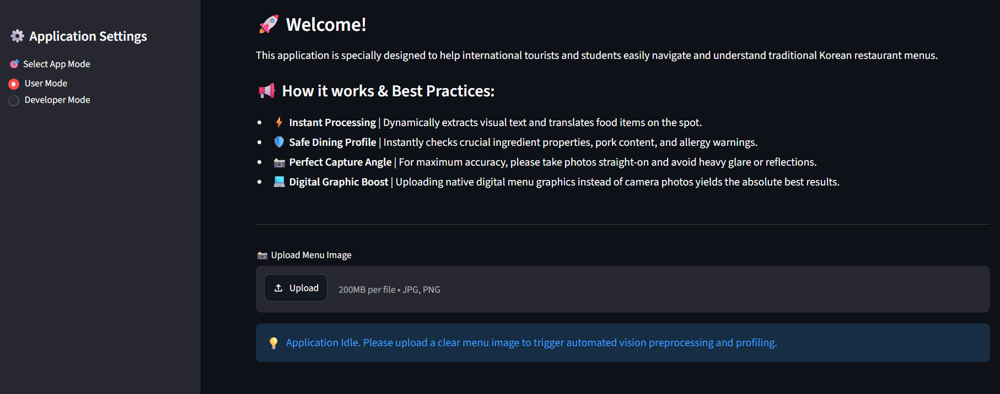
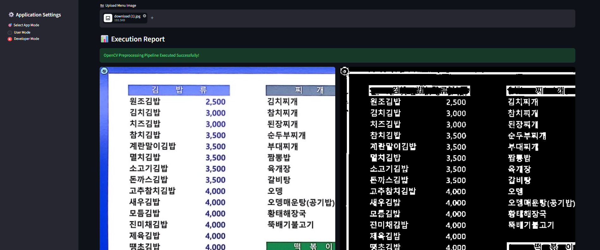
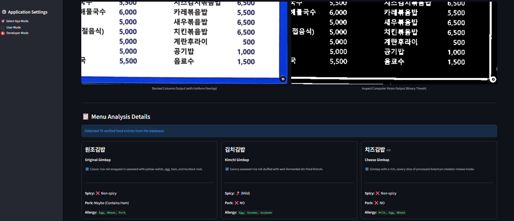
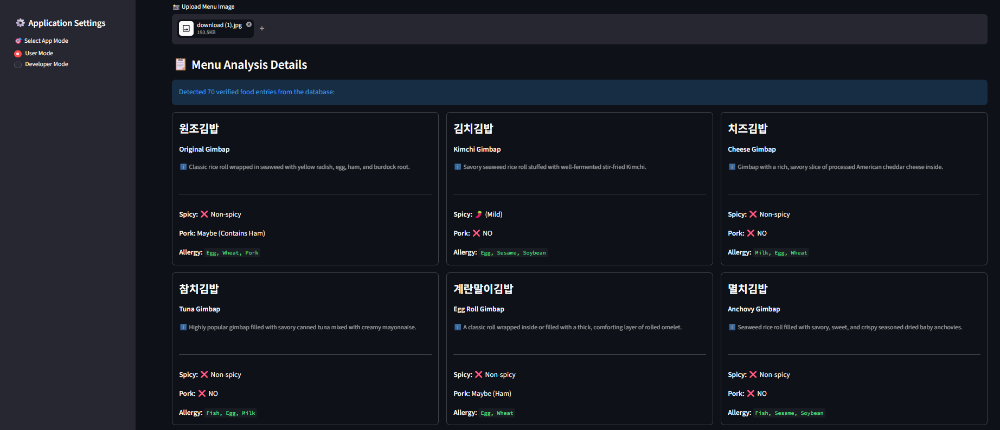

# 🌐 Smart Korean Food Menu Analyzer for Foreigners

## 소개

본 프로젝트는 컴퓨터 비전 및 이미지 처리 기술을 활용하여 한국 음식점의 메뉴판을 잘 이해하지 못하는 외국인 유학생과 관광객을 지원하는 **클라우드 기반 지능형 OCR 애플리케이션**입니다.

사용자가 메뉴 사진을 업로드하면 다중 열(Multi-column) 메뉴판의 구조적 특징을 분석하여 텍스트를 추출하고, 자체 구축된 데이터베이스와 매칭하여 **영어 번역, 상세 설명, 매운맛 단계, 알레르기 경고, 돼지고기(Pork) 포함 여부** 등 맞춤형 다이어트 프로필을 실시간으로 제공합니다.

- **Live Demo:** [Streamlit Cloud 링크](https://korean-food-menu-analyzer-for-foreigners.streamlit.app/)
- **Repository URL:** [GitHub 레포지토리 링크](https://github.com/atieh98/Korean-Food-menu-analyzer-For-Foreigners.git)

---

## 주요 기능

- **메뉴 이미지 내 한국어 텍스트 인식:** Tesseract OCR 엔진을 연동하여 다양한 한식 메뉴 이름을 정확하게 추출합니다.
- **다이어트 및 안전 정보 분석:** 추출된 메뉴를 기반으로 매운맛 단계, 돼지고기 포함 여부, 알레르기 유발 성분을 자동으로 분석합니다.
- **외국인 맞춤형 UI:** 한식을 처음 접하는 외국인도 쉽게 이해할 수 있도록 직관적인 영어 설명과 경고 카드로 시각화합니다.
- **클라우드 배포:** Streamlit Cloud를 통해 모바일 및 웹 어디서나 무설치로 접근할 수 있는 환경을 제공합니다.

---

## 추가 구현 기능 (실제 소스코드 핵심 기술)

1. **균일 오버랩 분할 알고리즘 (Uniform Column Segmentation):** 다중 열(Multi-column) 메뉴판 이미지의 전처리 시, 열을 3등분할 때 발생할 수 있는 픽셀 너비 불일치 문제를 해결하기 위해 `uniform_width` 수식을 적용했습니다. 이를 통해 `np.vstack` 결합 시 매트릭스 크기 불일치로 인한 크래시(Crash)를 원천 차단하고 안정적인 텍스트 영역을 확보합니다.
2. **3단계 회복력 있는 문자열 매칭 엔진 (3-Tier Resilient Parsing):** OCR 인식 과정에서 발생하는 공백, 오탈자, 마침표 등 기계적 노이즈를 극복하기 위해 삼중 필터링 알고리즘을 직접 설계했습니다.
   - **Level A:** 완전 일치 알고리즘 (Direct Substring Match)
   - **Level B:** 공백/문자 간격 허용 정규식 알고리즘 (Bounded Regex Character Gap Match)
   - **Level C:** 행 단위 문자 밀도 근접 매칭 알고리즘 (Line-Level Character Density Fallback)
3. **교차 플랫폼 환경 호환성 (Cross-Platform Dynamic Path):** 로컬 윈도우 환경(`os.name == 'nt'`)과 리눅스 기반 클라우드 서버 환경의 Tesseract 바이너리 경로를 유연하게 자동 전환하도록 예외 처리를 완료했습니다.
4. **개발자 모드(Developer Mode) 탑재:** 사용자를 위한 화면 외에, OpenCV가 전처리한 이진화 이미지(`Adaptive Thresholding`)와 OCR의 생(Raw) 텍스트 데이터 로그를 실시간으로 모니터링할 수 있는 대시보드를 추가 탑재했습니다.

---

## 파일 설명

- `app.py`: Streamlit 기반 웹 인터페이스 레이어, 유저/개발자 모드 제어 및 결과 시각화
- `image_processing.py`: OpenCV 파이프라인 (Bilateral Filter, Adaptive Gaussian Thresholding, 균일 이미지 슬라이싱 및 스택 처리)
- `menu_analyzer.py`: 가볍고 견고한 한식 데이터베이스 구축 및 3단계 퍼지 매칭 알고리즘 엔진
- `requirements.txt`: 클라우드 배포를 위한 파이썬 의존성 패키지 명세 (Headless OpenCV 포함)
- `packages.txt`: 리눅스 클라우드 컨테이너 환경을 위한 Tesseract-OCR 엔진 및 한국어 언어 팩 명세

---

## 시스템 동작 및 테스트 과정

애플리케이션의 실제 구동 및 테스트 단계는 다음과 같습니다.
_(아래 단계별 구동 화면은 프로젝트 내 `images/` 폴더의 스크린샷을 참조합니다.)_

### 1단계: 메인 화면 및 메뉴판 이미지 업로드

사용자가 시스템에 접속하여 분석하고자 하는 한국어 메뉴판 이미지를 업로드합니다.


### 2단계: 컴퓨터 비전 (OpenCV) 전처리 수행

`Developer Mode`를 활성화하면 내부 컴퓨터 비전 파이프라인이 작동하는 과정을 볼 수 있습니다. 양방향 필터(`Bilateral Filter`)로 노이즈를 제거한 뒤, 적응형 임계처리(`Adaptive Gaussian Thresholding`)를 통해 글씨의 윤곽선을 뚜렷하게 다듬고 균일한 너비로 이미지를 분할·합성합니다.


### 3단계: OCR 텍스트 추출 및 생(Raw) 로그 모니터링

Tesseract 엔진을 통해 가공된 이미지 내부의 한국어 자모음을 추출합니다. 3단계 매칭 알고리즘이 텍스트에 포함된 특수문자나 공백 노이즈를 실시간으로 제거하고 매칭을 시도하는 로그를 개발자 화면에 출력합니다.


### 4단계: 외국인 전용 맞춤형 카드 출력 (최종 결과)

성공적으로 인식된 메뉴들이 데이터베이스 내부의 정보와 매칭되어 직관적인 영어 카드 형태로 화면에 나타납니다. 외국인은 번역된 이름, 성분 설명과 함께 매운맛 강도와 알레르기 성분을 즉시 파악할 수 있습니다.


---

## 코드 설명 핵심 요약

1. **이미지 전처리 및 스택 기술 (`image_processing.py`)**

```python
# 3등분한 이미지 슬라이스의 너비를 완벽히 통일시켜 np.vstack 에러 방지
uniform_width = w_slice + (2 * padding)
col1 = image[0:h, 0:uniform_width]
col2 = image[0:h, w_slice - padding : w_slice * 2 + padding]
col3 = image[0:h, w - uniform_width : w]
stacked_image = np.vstack((col1, col2, col3))
```

단순 분할 시 이미지 크기가 1픽셀이라도 어긋나면 결합 크래시가 발생하므로 패딩을 포함한 고정 너비를 강제 적용하고, 가우시안 적응형 이진화 알고리즘을 사용해 OCR 인식률을 극대화했습니다.

2. **노이즈 극복 매칭 알고리즘 (`menu_analyzer.py`)**

```python
# Level B: 글자와 글자 사이에 마침표나 공백이 낀 경우 정규식으로 우회 매칭 ("김.밥" -> "김밥")
pattern = ".*".join(list(food_name))
if re.search(pattern, cleaned_text_block):
    matched_items.append({"korean_name": food_name, **details})
```

OCR 텍스트의 불완전함을 보완하기 위해 단순 서브스트링 검사를 넘어 정규식 문자 갭 매칭 및 행 단위 타깃 가중치 근접 검사 로직을 독립적으로 설계하여 데이터 누락을 대폭 줄였습니다.

---

## 느낀 점

프로젝트를 진행하며 컴퓨터 비전과 OCR 기술을 결합하는 과정에서 다중 열 메뉴판 이미지의 픽셀 너비를 오차 없이 맞추는 블렌딩 및 슬라이싱 처리가 생각보다 까다롭다는 것을 배웠습니다. 또한, 기계가 인식한 불완전한 문자열 데이터를 소프트웨어 공학적(정규식 및 퍼지 밀도 알고리즘)으로 보완해 나가는 과정을 통해 실무적인 문제 해결 능력을 기를 수 있었던 유익한 프로젝트였습니다.
